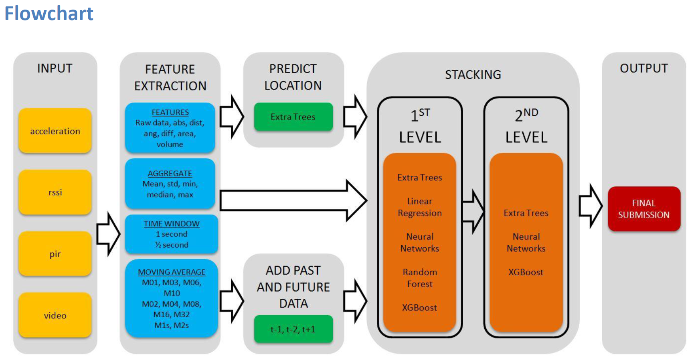
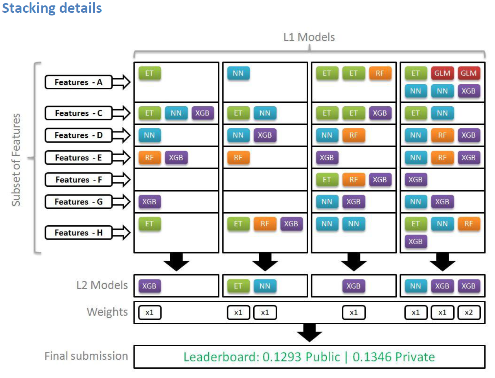

# Senior Data Science: Safe Aging with SPHERE - 1st Place

# Entrant Background and Submission Overview

### Mini-bio
I am Building Services Design Engineer, specialized in bioclimatic design and energy efficiency.

Two years ago I started learning about Machine Learning & Artificial Intelligence, and I have been involved in Data Science Competitions during the last year. Now I am looking for new job opportunities in these areas.

### High Level Summary of Submission
The most of the time I was working on feature engineering. I made parallel research for each group of data (i.e. accelerometer, rssi, pir and video). Finally I generated a bunch of features as combination of different techniques:

* Moving Average: time window between registers is very noisy. I got good results calculating the moving average for several registers. It was particularly good for video data (M10, average of past 10 registers, actual register, and future 10 registers), rssi (M32) and pir (M2s, past 2 seconds, actual second, future 2 seconds).

* New features: For each type of data, I created some useful features. Best results were obtained for video data, extracting distances, areas, volume, and moving features.

* Time window: Before aggregate registers, I used the standard 1 second time window, and also two windows of 0.5 seconds each. The last one resulted very useful.

* Aggregation: Mainly the same as the example benchmark: mean, max, min, median and standard deviation.

Finally I added a new meta-feature (predicted location), past data (2 seconds) and future data (1 second).

In order to generate variation on the predictions and consequently good results after stacking, I selected 7 subsets of features by random/optimization and I trained a bunch of Layer 1 models with them (ExtraTrees, RandomForest, XGBoost, Neural Networks and Linear Regression).

In Layer 2, I selected again 4 subset of meta-features (L1 models) by random/optimization and I trained 7 L2 models. The final submission is a weighted average of theses predictions.

### Omitted Work
I tried some different approaches to the problem:

* Multi-class classification: Data generated joining multiclass labels for each annotator. This way I could use multi-class classification algorithms instead of multi-task regression. I didn't get good results, as it is hard to implement with enough accuracy in the final probabilities.

* Continuous time predictions: I tried predicting the 1 second time-window in a continuous way, i.e. (1.0 - 2.0 s), (1.1 - 2.1 s), (1.2 - 2.2 s), .... I was positive about this approach, but at the end I didn't get better scores when predicting test data.

* Recurrent Neural Networks: I tried simple and very complex architectures, but I didn't get good enough results.

### Tools Used

I just used the tools provided with the competition documentation and benchmark example.

### Model Evaluation

I used 10-folds cross validation using the 10 train sequences. I used the same folds to generate train meta-features for stacking.

The best single model I have obtained during the competition was an ET multi-task model of Public LB score 0.1491, Private LB score 0.1545, and local CV score of 0.1708. My final winning submission scored 0.1293 on Public LB, 0.1346 on Private LB, and local CV score of 0.1547.

### Potentially Helpful Features
I found 'rssi' the most useful feature predicting location. Combined with 'pir' give us good accuracy, and I found that improving more the accuracy of these predictions doesn't help that much when predicting actions.

'Video' was the most important feature, followed by the accelerometer data, so I guess that more video cameras would help. Maybe a second accelerometer attached to the ankle would be helpful when predicting specific actions.

Other features like time could be helpful to predict some behavior.

### Notes About the Model
The way the code generates features is very time-inefficient. It was useful to try different feature combinations and during the contest process, but could be optimized to use in a production stage.

The stacking pipeline and the big amount of models look harmful in order to make predictions quickly, but this can be optimized without big loss in accuracy. You can get good results stacking just one ET, NN and XGB, trained for fewer rounds, and using just one L2 model. I think we could get a score around 0.1350 (public LB) reducing significantly the execution time.

### Graphic Representation

The Images below demonstrate the modeling and stacking processes used.

### Future Steps
I am disappointed with the results obtained with recurrent NN. I tried out this in a early stage of the contest, when I hadn't developed all the feature engineering, and maybe now I could get better results. I think this could be a fast and flexible implementation in real situations.

  
# Replicating the Submission

The best single model I have obtained during the competition was an [ExtraTreesRegressor](http://scikit-learn.org/stable/modules/generated/sklearn.ensemble.ExtraTreesRegressor.html) (ET) multi-task model of Public LB score **0.1491** and Private LB score **0.1545**. My final winning submission was a weighted average ensemble of 7 stacked models (L2 models) of single models predictions (L1 models), including ET, [NeuralNetworks](https://keras.io/) (NN), [RandomForestRegressor](http://scikit-learn.org/stable/modules/generated/sklearn.ensemble.RandomForestRegressor.html#sklearn.ensemble.RandomForestRegressor) (RF), [XGBoost](https://xgboost.readthedocs.io/en/latest/) (XGB), and [LinearRegression](http://scikit-learn.org/stable/modules/generated/sklearn.linear_model.LinearRegression.html#sklearn.linear_model.LinearRegression) (GLM). This submission scored **0.1293** on Public LB and **0.1346** on Private LB.

### Install Python 2.7.11
* Install Packages:
    * Numpy
    * Pandas
    * scikit-learn
    * matplotlib
    * Keras 1.0.2
    * Theano 0.8.2
    * XGBoost 0.4a30

### Instructions

1. Download data from the [competition website](https://www.drivendata.org/competitions/42/data/) and put all the data into folder `./public_data`.

2. Run `python ./code/01_Features_Generation.py` to generate features. This will take 3.5 to 4 hours in a 12 threads computer. Folder `./preprocessed_data` will be created with the output of the code.

3. Run `python ./code/02_Predict_Location.py` to predict location.  This will take 10 minutes in a 12 threads computer. Folder `./predict_location` will be created with the output of the code.

4. Run `python ./code/03_Train_L1_Models.py` to train & predict L1 models.  This will take 31 hours in a 12 threads computer with Nvidia GTX 980Ti gpu for NN. Folder `./submissions` will be created with the output of the code.

5. Run `python ./code/04_Train_L2_Models.py` to train & predict L2 models and generate final submission.  This will take 17 minutes in a 12 threads computer with Nvidia GTX 980Ti gpu for NN.

6. If you don't want to run the code, just submit the file in `./final_submission/`.
