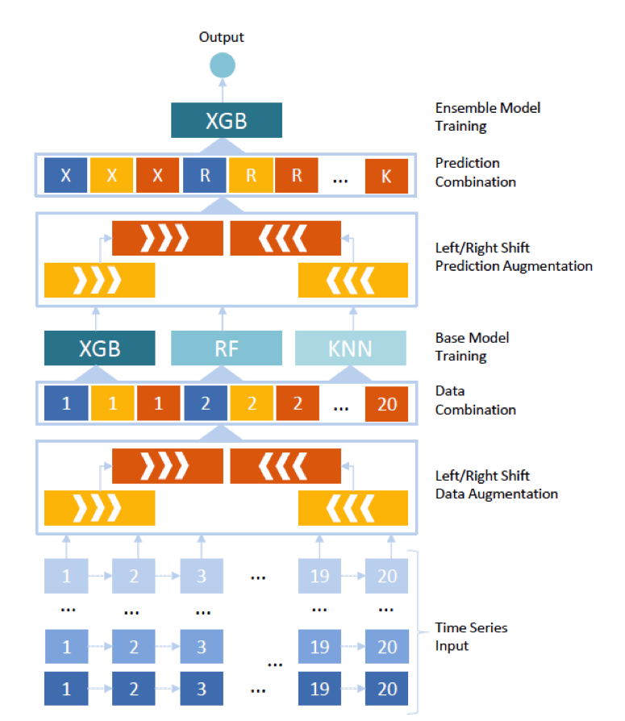

# Senior Data Science: Safe Aging with SPHERE - 3rd Place

# Entrant Background and Submission Overview

### Mini-bio
He is a data analytics project lead in banking and insurance including customer churn analysis, customer segmentation, and risk analytics.

Her work involves processing data and building machine learning algorithms. Besides work, her interest is doing modeling competitions to find new challenges and to learn from the best.

### High Level Summary of Submission
We carried out intensive feature engineering on sensory data. We found that the historical signal is important to recognize the current activity therefore we generated many first and second-order lag features. We then trained dozens of models using various algorithms such as logistic regression, random forest, and extreme gradient boosting tree. Our final submission is an ensemble model of these base models.

### Omitted Work
We tried both LSTM and Bi-LSTM but none of them worked better than XGBoost. Therefore, we did not include them in our final submission.

### Model Evaluation
Besides Brier metric, we also used log loss to evaluate the performance of our models.

### Notes About the Model
To recognize current activity, we utilized past and future sensory data as features. Therefore, this model cannot be applied to real time activity recognition because we won’t have future data at the time of making prediction.

### Graphic Representation

The Images below demonstrate the modeling process.

### Future Steps
We think that sequential deep learning techniques might work for this problem. During the competition, we have tried both LSTM and Bi-LSTM but none of them work better than XGBoost. Maybe we should try deep learning again.

# Replicating the Submission

To generate the submission:
1. Prepare Python 2.7

2. Install all necessary tools in requirements.txt

3. Using Jupyter notebook, open n2-sphere-reproducibility.ipynb for details

4. Please find the final submission ens13.csv in sub folder
